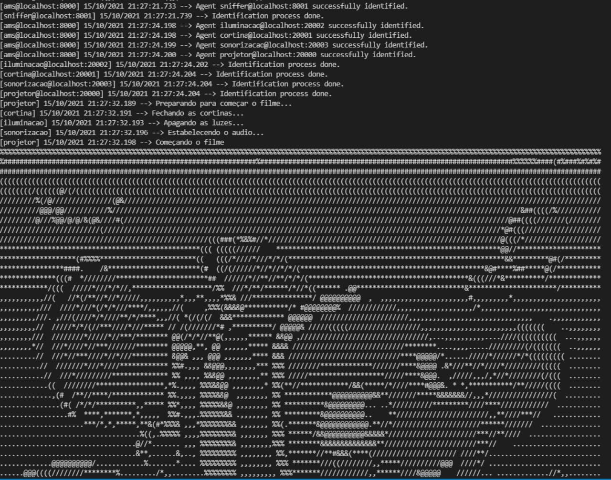
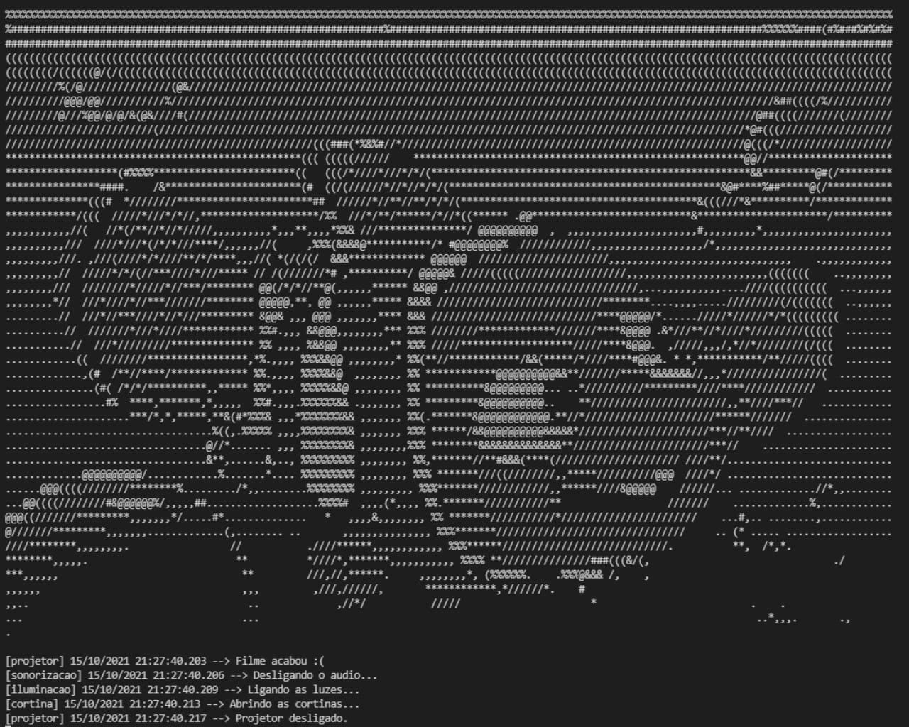

# Agent Speak

**Disciplina**: FGA0210 - PARADIGMAS DE PROGRAMAÇÃO - T01 <br>
**Nro do Grupo**: 04<br>
**Paradigma**: Multi Agentes<br>

## Alunos

| Matrícula  | Aluno                          |
| ---------- | ------------------------------ |
| 17/0103200 | Gabriel Alves Hussein          |
| 17/0011119 | Geraldo Victor Alves Barbosa   |
| 18/0102613 | Ítalo Fernandes Sales de Serra |
| 18/0103431 | João Victor Valadão de Brito   |
| 18/0020251 | João VItor Lopes de Farias     |

## Sobre

Consiste em um sistema multi agente onde os agentes seriam os aparelhos de uma sala de aula, é simulado um cenário onde o professor deseja apresentar um filme para a turma e os agentes (aparelhos) devem ser capazes de preparar o ambiente conforme este cenário, para o escopo do projeto temos os seguintes agentes:

- Agente projetor: responsável por ligar o projetor quando o cenário é iniciado e se comunicar com o agente cortina para fechar as cortinas quando estiver ligado, também é responsável por desligar o projetor quando solicitado pelo agente cortina.
- Agente cortina: responsável por abrir a cortina quando é solicitado pelo agente projetor e fechar a cortina quando o agente iluminador solicita.
- Agente iluminador: responsável por desligar a luz quando o agente cortina solicita e ligar a luz quando o agente sonorização solicita.
- Agente sonorização: responsável por preparar a sonorização para a reprodução do filme quando solicitado pelo agente iluminador, ao término do filme desliga a sonorização e solicita para o agente iluminador para iniciar o processo inverso de preparação do filme e em cadeia ser solicitado aos outros agentes que façam as suas devidas responsabilidades.

O projeto se baseou em uma ideia proposta pelo artigo [Integrando agentes AgentSpeak(L) em ambientes pervasivos
educacionais](http://www.wesaac.c3.furg.br/storage/proceedings/cw88aA0ZdX4ahRYWlN46aLl7JMwk0OWyi2DfeVJQ.pdf), para o código foi utilizado como base o repositório de uma equipe do semestre passado: <a>https://github.com/UnBParadigmas2020-2/2020.2_G4_SMA_Leilao</a> utilizando o PADE que é um framework para desenvolvimento, execução e gerenciamento de sistemas multiagentes em ambientes de computação distribuída. O PADE serviu para fazermos as comunicações entres os agentes.

## Screenshots

<p align="center">

<br>

</p>

## Instalação

**Linguagens**: Python<br>
**Tecnologias**: PADE<br>

## Instalação 

Para instalar o PADE ```pip install pade```

## Execução

Após as instalações necessárias para rodar o projeto execute o seguinte comando na raiz do projeto:

```pade start-runtime --port 20000 main.py```

## Uso

O projeto não possui entrada de dados apenas um cenário que foi definido previamente, que seria o de 

## Vídeo
Um vídeo foi gravado demonstrando algumas partes do projeto pelos membros do grupo, o mesmo pode ser assistido abaixo:

<!-- [](https://www.youtube.com/watch?v=NCiFX79jX50) -->

## Fontes

[PADE](https://pade.readthedocs.io/pt_BR/latest/)</br>
